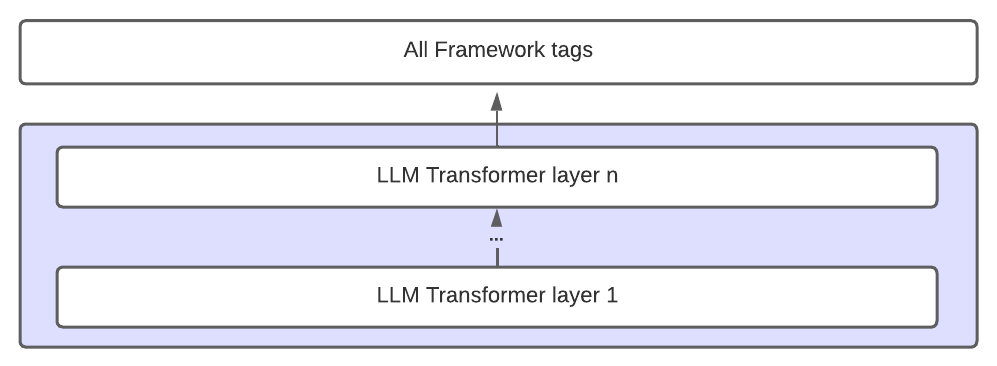
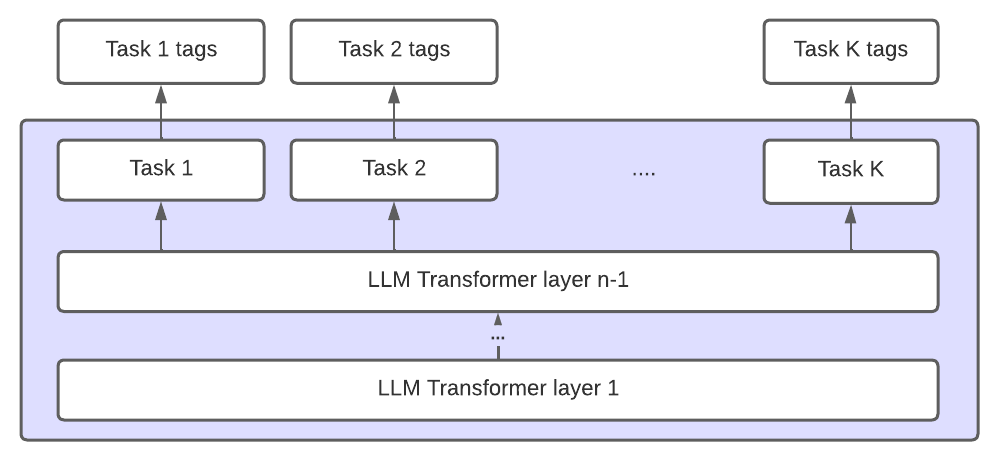

# classifier-trainer
This Python Package is intented to automatically train NLP classification model from labeled data.

## Full Documentation
**Install library**
```
!pip install git+https://github.com/the-deep-nlp/classifier-trainer
```
**Train Classification model**
```
from classifier_trainer import ClassifierTrainer
trainer = ClassifierTrainer()

trained_model = trainer.train_classification_model(
    - train_df: pd.DataFrame: Training DataFrame with 2 columns: ["excerpt", "target_classification"],
    - val_df: pd.DataFrame: Validation DataFrame with 2 columns: ["excerpt", "target_classification"],
    - architecture_setup: str: one of ["base_architecture", "multiabel_architecture"], default='multiabel_architecture',
    - backbone_name: str: Backbone Name in HuggingFace, default='nlp-thedeep/humbert',
    - results_dir: str: Results directory, default='results',
    - enable_checkpointing: bool: Whether or not to save model checkpoints while training, default=True,
    - save_model: bool: Whether or not to save the model after training, default=True,
    - n_epochs: int: Number of total training epochs, default=3,
    - dropout: float: Dropout rate, default=0.2,
    - weight_decay: float: AdamWeight weight decay, default=1e-2,
    - learning_rate: float: Training Learning Rate, default=5e-5,
    - max_len: int: Max entry input length, default=200,
    - n_freezed_layers: int: Number of freezed layers in the model training, default=1,
    - train_batch_size: int: Training batch size, default=8,
    - val_batch_size: int: Validation batch size, default=16,
    - loss_gamma: float: Gamma parameter in the focal loss, default=1,
    - proportions_pow: float: Alpha parameter in the focal loss, default=0.5,
)
```
**Load Trained Model**
```
from classifier_trainer import ClassifierTrainer
import pandas as pd

trainer = ClassifierTrainer()

trained_model = trainer.load_model(
    - model_path: str: path of the saved model
)
```
**Generate test set predictions**
```
test_set_predictions = trainer.generate_test_predictions(
    - sentences: List[str]: List of entries
)
```
**Generate test set results**
```
test_set_results = trainer.generate_test_results(
    - test_df: pd.DataFrame: test set results
    - generate_visulizations: bool: Whether to generate visualisations of the test results, default=True,
    - save_results: bool: Whether to save results, default=True,
)
```

## Training Architectures
We present 2 training architectures
- **Base Architecture**: a linear classification head is defined to predict each class. 
The baseline architecture does not take into account the hierarchy or the relationships of the framework's labels
and treats all the categories with the same encoded embedding.
<p float="center">
  
</p>

- **Our proposed Architecture**: our approach shares N-1 Transformer layers of the LLM across all the categories,
while the Nth layer is replicated K times, K being the number of classification tasks.  
A linear classification head is then defined on top of each Transformer
sub-layer, predicting only the labels belonging to the corresponding task. 
The resulting architecture is a combination of the shared parameters and specific components and follows 
the relations and hierarchy of the analytical framework's label space. 
<p float="center">
  
</p>


## Example Usages
**Train model from scratch**
```
from classifier_trainer import ClassifierTrainer
import pandas as pd

trainer = ClassifierTrainer()

train_df = pd.read_csv(TRAINING DATAFRAME PATH)
val_df = pd.red_csv(VALIDATION DATAFRAME PATH)

trained_model = trainer.train_classification_model(train_df, val_df)
```
**Load Trained Model**
```
from classifier_trainer import ClassifierTrainer
import pandas as pd

trainer = ClassifierTrainer()

trained_model = trainer.load_model(TRAINED_MODEL_PATH)
```
**Generate test set predictions**
```
test_set_predictions = trainer.generate_test_predictions(test_df.excerpt.tolist())
```
**Generate test set results**
```
test_set_results = trainer.generate_test_results(test_df)
```